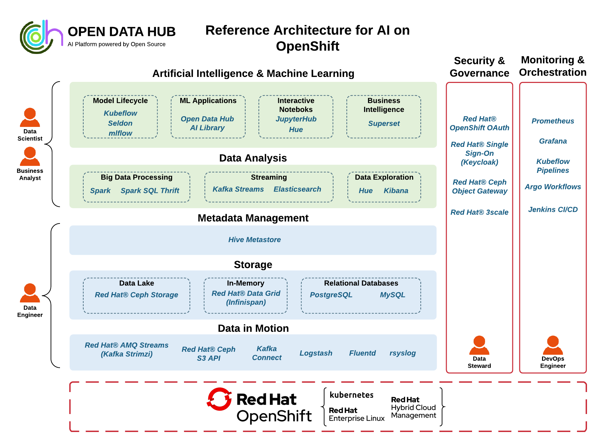
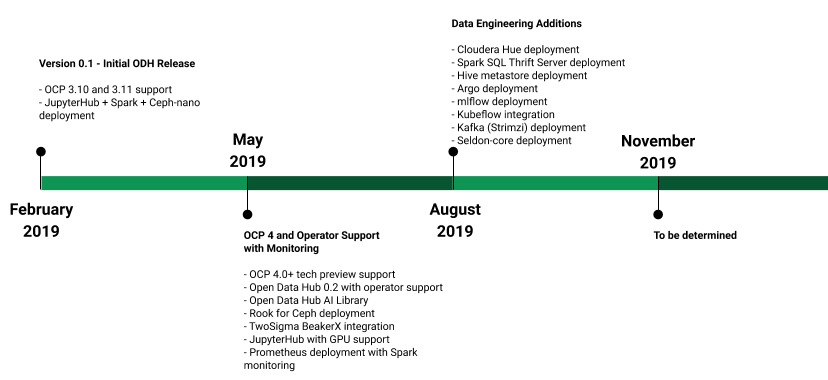

## Abstract

The purpose of this document is to provide guidelines and considerations for installing and managing AI services using Open Data Hub on Openshift Container Platform.Deploying and Managing Artificial Intelligence Services using the Open Data Hub Project on Openshift Container Platform

## Comments and Feedback

In the spirit of open source, we invite anyone to provide feedback, comments and contribution to this content. Feedback on the papers can be provided by emailing contributors@lists.opendatahub.io. Please refer to the title within the email. Contribution to content can also be made using [opendatahub gitlab](https://gitlab.com/opendatahub/opendatahub.io) and providing merge requests.

## Executive Summary

This reference architecture describes the architecture, deployment and management of Artificial Intelligence (AI) services on Openshift Container Platform. The reference architecture is built mainly with open source tools providing services for each step of the AI end-to-end workflow. Target audience for this reference architecture includes but is not limited to Architects, Developers, Data Engineers, Data Scientists and DevOps individuals working in the AI realm.

[Open Data Hub (ODH)](https://opendatahub.io/) is an open source project originally initiated by Red Hat AI Center of Excellence team as an effort to provide open source AI tools for running large and distributed AI workloads on Openshift Container platform. Currently, Open Data Hub project provides open source tools for data storage, distributed AI and Machine Learning(ML) workflows and Notebook development environment. The Open Data Hub project roadmap also includes tools specifically for monitoring and managing AI services.

[AI Library](https://gitlab.com/opendatahub/ai-library) is also an open source project initiated by Red Hat AI Center of Excellence team as an effort to provide ML models as a service on Openshift Container Platform. The development of these models as services is a community driven open source project to make AI/ML models more accessible.

This reference architecture serves as a potential blueprint for deploying and managing open source AI services from the Open Data Hub and AI Library projects to provide an end-to-end platform for running large and distributed AI workloads as well as serving and monitoring ML models on Openshift Container Platform.

## AI as Service High Level Architecture

A complete end-to-end AI platform requires services for each step of the AI workflow. In general, an AI workflow includes most of the steps shown in Figure 1  and is used by multiple AI engineering personas such as Data Engineers, Data Scientists and DevOps.

**Figure 1: AI Workflow**


The first phase of an AI workflow is initiated by Data Engineers that acquire the data from different sources and perform the required transformations. Data Engineers are also responsible to store and provide access to the transformed data to Data Scientist or Data Analysts that work on the second phase in the AI workflow. In the second phase, Data Scientists perform analysis on the transformed data and create the appropriate ML models. Once the models are trained and validated accordingly, they are ready to be served on the production platform in the last phase of the AI end-to-end workflow. In the production phase, ML models are served as services on the cluster and DevOps engineers are tasked with constantly monitoring and optimizing the services. The process does not end at this last step, Data Scientists should monitor and keep validating models based on incoming and trained data sets.

**Red Hat® OpenShift®  Container Platform**  is the leading Kubernetes based container platform providing multiple functionalities for successfully running distributed AI workloads. Functionalities such as high availability and self-healing, scaling, security, resource management and operator framework are essential to successfully providing AI/ML services. OpenShift also also supports specialized hardware such as GPUs.

**Open Data Hub**(ODH) currently provides services on Openshift for AI data services such as data storage and ingestion/transformation. For data storage and availability, ODH provides [Ceph](https://ceph.com/), with multi protocol support including block, file and S3 object API support, both for persistent storage within the containers and as a scalable object storage data lake that AI applications can store and access data from . Rook operator can be used to easily deploy and integrate Ceph into the OpenShift and ODH ecosystem

Open Data Hub also provides services for model creation, training and validation. Apache Spark™([https://spark.apache.org/](https://spark.apache.org/)) operator is provided as part of ODH installation for distributed data ingestion, transformation and model functionalities running natively on Openshift. For the Data Scientist development environment, ODH provides Jupyter Hub and Jupyter Notebook images running natively distributed on Openshift. ODH roadmap includes tools for monitoring services as discussed in the section below. These tools will include the ability for natively monitoring AI services and served models on Openshift using Prometheus and Grafana.

**AI Library** provides REST interface access to pre-trained and validated served models for Sentiment Analysis, Flake Analysis and Duplicate Bug Detection.

## Open Data Hub Platform

Open Data Hub platform is a centralized self-service solution for analytic and data science distributed workloads. It is a collection of open source tools and services natively running on Openshift.
### Components and Considerations

#### End-to-End Considerations

ODH project’s main goal is to provide an open source end-to-end AI platform on Openshift Container Platform that is equipped to run large AI/ML distributed workloads. As discussed earlier an end-to-end AI platform includes all phases of AI processing starting from data ingestion all the way to production AI/ML hosting and monitoring. There are multiple user personas for this platform that work on different phases. Figure 2  displays a high level architecture diagram of ODH as an end-to-end AI platform running on Openshift Container platform.

  

All the tools and components listed below are currently being used as part of Red Hat’s internal ODH platform cluster. This internal cluster is utilized by multiple internal teams of data scientists running AI/ML workloads for functions such as Anomaly Detection and Natural Language Processing. A subset of these components and tools are included in the ODH release available today and the rest are scheduled to be integrated in future releases as described in the roadmap section below.

**Figure 2: End-to-End Reference AI Architecture on Openshift**

  

**Data in Motion** is essential in today's enterprise backend networks where data resides in multiple locations, especially to support data stored in legacy systems. Hybrid Cloud architectures also require sharing data between different cloud systems. Tools such as Red Hat AMQ Streams, Kafka and Logstash provide robust and scalable data transfer capabilities native to the Openshift platform. Data Engineers can use these tools to transfer required data from multiple sources.

  

**Storage: Data Lake/Databases/In-Memory** includes  tools for distributed file, block and object storage at scale. We include tools for both relational databases and document-oriented databases. Big data storage requires the freedom of no schema constraints while data access requires some form of ordered schema definition. Data ingestion can be easily performed using Red Hat Data Grid into distributed object storage provided by Ceph. High performance in-memory datastore solutions such as Red Hat Data Grid which is based on Infinispan are essential for fast data access needed for analysis or model training.

  
**Metadata Management** tools basically add informational metadata to the stored data such as databases, tables, columns, partitions, schemas and location. Currently, we have investigated Hive Metastore as a solution that provides an SQL interface to access the metadata information.

  

**Data Analysis: Big Data Processing** tools are needed for running large distributed AI workloads. Apache Spark™is installed as an operator on OCP providing cluster wide custom resource to launch distributed AI workloads on distributed spark clusters. These spark clusters are not shared among users, they are specific to each user providing isolation of resource usage and management. Spark clusters are also ephemeral and are deleted once the user shuts down the notebook providing efficient resource management.

  

**Data Analysis: Data Exploration** tools provide the  query and visualization functions for data scientists to perform initial exploration of the data. Hue provides an SQL interface to query the data and basic visualization. Kibana is also a data visualization tool for Elasticsearch indexed data.

  

**Data Analysis: Streaming** tools such as Kafka and Elasticsearch allow for distributed and scalable message distribution native to Openshift.

  

**Artificial Intelligence and Machine Learning: Model Lifecycle** tools provide functionalities to serve the model and collect essential metrics needed to monitor the lifecycle of the model. It allows constant evaluation of model performance which can lead to the need for retraining or re-validation. [Seldon](https://www.seldon.io/) is a tool that provides model hosting and metric collection from both the model itself and the component serving the model. MLflow provides parameter tracking for models and deployment functionalities.

  

**Artificial Intelligence and Machine Learning: ML Applications** such as the Open Data Hub AI Library provides pre-trained models such as sentiment analysis and topic modeling. These models can be deployed and used for prediction out of the box making it effortlessly accessible to users.

  

**Artificial Intelligence and Machine Learning: Interactive Notebooks** provide a development workspace for data scientists and business analysts to conduct their analysis work. [JupyterHub](https://jupyter.org/hub) is a tool that provides a multi-user notebook environment that allows users to use notebooks running in their own workspace. This allows for resource management isolation. Hue is also a multiuser data analysis platform that allows querying and plotting of data.

  

**Artificial Intelligence and Machine Learning: Business Intelligence** tools such as [Apache Superset](https://superset.incubator.apache.org/) provide a rich set of data visualization tools and come enterprise-ready with authentication, multi-user and security integrated.  
  

**Security and Governance** include tools for providing services, data and API security and governance. Data in storage and in motion require security for both access and encryption. The Ceph Object Gateway provides encryption of uploaded objects and options for the management of encryption keys. The Ceph Object Gateway stores that data in the Ceph Storage Cluster in encrypted form. Red Hat Single Sign-On ([Keycloak](https://www.keycloak.org/)) and Openshift provide user authentication while Red Hat 3Scale provides an API gateway for REST Interfaces.

  
**Monitoring and Orchestration** provide tools for monitoring all aspects of the end-to-end AI platform. This includes but is not limited to data, messaging, API, resources availability and utilization, etc. Prometheus and Grafana offer an interface for collecting and displaying metrics. For orchestration tools we included Jenkins and Argo Workflows that provide the functionality to create and manage workflows for build and release automation. Argo is Openshift native workflow tools that can run pods in a directed acyclic graph (DAG) workflow.


#### Current Included Components

The ODH platform is installed on Openshift as a native operator and is available on the OperatorHub.io. The operator framework ([https://operatorhub.io/getting-started](https://operatorhub.io/getting-started)) is an open source toolkit that provides effective, scalable and automated native application management. Operators manage custom resources that provide specific cluster wide functionalities. The ODH operator manages the ODH platform AI/ML services cluster-wide. Some of the components within the ODH platform are also operators such as Apache Spark™. Currently ,when installing the ODH operator it includes the following components: Ceph, Apache Spark, Jupyterhub, Prometheus and Grafana.
  

**Ceph** is an open source object store that is massively scalable. It can run natively in OpenShift or as a standalone cluster for optimized performance. Ceph provides a scalable Ceph Storage Cluster native to Openshift, allowing the distributed storage of massive data sets as typical of AI/ML workflows. Ceph is ideal for storing unstructured data from multiple sources which is also ideal for large AI/ML dataset ingestions. Ceph provides S3 RESTful API that is widely supported and is simple to use, making AI/ML data that is stored and transformed easily accessible. Ceph is deployed on OpenShift via Rook ([https://rook.io](https://rook.io/)), a storage operator that provides a user friendly way for deployment and integration of Ceph into the OpenShift ecosystem.

  
**Apache Spark™** operator is an open source operator implementation of Apache Spark™. It is developed as part of the Radanalytics community ([https://radanalytics.io/](https://radanalytics.io/)) to provide distributed Spark cluster workloads on Openshift. This implementation creates a Spark cluster with master and worker/executor processes. Applications send tasks to executors using the SparkContext and these executors run the tasks on the cluster nodes they are assigned to. Distributed parallel execution as provided by Spark clusters are typical and essential for the success of AI/ML workloads.
  

**JupyterHub** ([https://jupyter.org/hub](https://jupyter.org/hub)) is an open source multi-user notebook platform that ODH provides with multiple notebook image streams that incorporate embedded features such as Spark libraries and connectors. JupyterHub provides many features such as multi-user experience for data scientists allowing them to run notebooks in their own workspaces. Authentication can also be customized as a pluggable component to support authentication protocols such as OAuth. Data scientists can use familiar tools such as Jupyter notebooks for developing complex algorithms and models. Frameworks such as numpy, scikit-learn, Tensorflow and more are available for use.

  
**Prometheus** ([https://prometheus.io/](https://prometheus.io/)) is an open source monitoring and alerting tool that is widely adopted across many enterprises. Prometheus can be configured to monitor targets by scraping or pulling metrics from the target’s HTTP endpoint and storing the metric name and a set of key-value pairs in a time series database. For graphing or querying this data, Prometheus provides a web portal with rudimentary options to list and graph the data. It also provides an endpoint for more powerful visualization tools such as Grafana to query the data and create graphs. An Alert Manager is also available to create alert rules to produce alerts on specific metric conditions.

**Grafana** ([https://grafana.com/](https://grafana.com/)) is an open source tool for data visualization and monitoring. Data sources such as Prometheus can be added to Grafana for metrics collection. Users create Dashboards that include comprehensive  graphs or plots of specific metrics. It includes powerful visualization capabilities for graphs, tables, and heatmaps. Ready-made dashboards for different data types and sources are also available giving Grafana users a head start. It also has support for a wide variety of plugins so that users can incorporate community-powered visualisation tools for things such as scatter plots or pie charts.

### Roadmap

ODH release schedule is displayed in the roadmap figure. ODH version 0.1 was released in February 2019 and included APB (Ansible Playbook Bundle) installation on OCP 3.10 and 3.11. It included three main components: JupyterHub, Apache Spark and Ceph-nano. Release version 0.2 is expected mid-May and will be an operator installation on OCP 4.0. This ODH operator will be available for download from the OperatorHub.io community operator. In addition to the core components it will also include: AI Library, Ceph TwoSigma BeakerX, GPU support for JupyterHub and Prometheus with Apache Spark monitoring. ODH August release will add Argo, MLFlow, Kafka and Sedon-core. For detailed information on ODH roadmap please visit [https://opendatahub.io/news/2019-04-29/project-road-map-for-2019.html](https://opendatahub.io/news/2019-04-29/project-road-map-for-2019.html).

**Figure 3: Open Data Hub Roadmap**



### Community

Open Data Hub project portal is available at [https://opendatahub.io/](https://opendatahub.io/). All source code is available on gitlab at [https://gitlab.com/opendatahub](https://gitlab.com/opendatahub). To join the community sign up for mailing lists at [https://lists.opendatahub.io/admin/lists/](https://lists.opendatahub.io/admin/lists/).

## Deploying Open Data Hub Core Components

### Pre-requisites

Installing ODH requires Openshift 3.11 or 4.0 Cluster. If this is not available, users can request a developer preview cluster with Openshift 4.0 installed here t[ry.openshift.com](https://try.openshift.com/). Official Openshift production documentation for OpenShift 4.1 ([https://docs.openshift.com/container-platform/4.1/welcome/index.html](https://docs.openshift.com/container-platform/4.1/welcome/index.html)) and OCP 3.11 ([https://docs.openshift.com/container-platform/3.11/welcome/index.html](https://docs.openshift.com/container-platform/3.11/welcome/index.html)). OCP 4.0 can also be installed on Amazon Web Services (AWS) following this tutorial ([https://github.com/openshift/training](https://github.com/openshift/training)).

Ansible is also required for installing monitoring tools and AI Library. Please follow installation instructions here: [https://docs.ansible.com/ansible/latest/installation_guide/intro_installation.html](https://docs.ansible.com/ansible/latest/installation_guide/intro_installation.html)

### Installation

The Open Data Hub operator deploys and manages various components using the [Operator SDK](https://github.com/operator-framework/operator-sdk) in the Operator Framework. There are two options to deploy ODH operator: Manual and using Operator Lifecycle Manager (OLM). Both require Openshift 3.11 or 4.0 and an installation of Ceph using Rook operator.

  

The latest version of the Open Data Hub operator project is located here: [https://gitlab.com/opendatahub/opendatahub-operator](https://gitlab.com/opendatahub/opendatahub-operator)

  

The latest version of the Open Data Hub operator image is located here: [https://quay.io/opendatahub/opendatahub-operator](https://quay.io/opendatahub/opendatahub-operator)

  

The following installation instructions will describe installing Ceph(Rook) followed by ODH operator.

#### Ceph installation with the Rook operator

To install Ceph with the Rook operator, please follow these instructions (this does require cluster-admin permissions):

1.  Clone the Rook operator    
```bash
git clone https://github.com/rook/rook.git
cd rook
```   

2.  Checkout Rook v0.9.3
```bash
git checkout -b rook-0.9.3 v0.9.3
cd cluster/examples/kubernetes/ceph/
```
    

3.  You will need to edit [operator.yaml](https://gist.githubusercontent.com/mmgaggle/94742f127070d7f0191b00d57f90d564/raw/e5f712309e411420bcc423b93aa90b13f80303ab/operator.yaml), [cluster.yaml](https://gist.githubusercontent.com/mmgaggle/94742f127070d7f0191b00d57f90d564/raw/e5f712309e411420bcc423b93aa90b13f80303ab/cluster.yaml), [rook-config-override.yaml](https://gist.githubusercontent.com/mmgaggle/94742f127070d7f0191b00d57f90d564/raw/3a774a99a4ded7012fb398c65bebb3796dd6dac1/rook-config-override.yaml) and [object.yaml](https://gist.githubusercontent.com/mmgaggle/94742f127070d7f0191b00d57f90d564/raw/e5f712309e411420bcc423b93aa90b13f80303ab/object.yaml). For those that are curious, you can use the following command to see the differences between these versions and the default custom resource definitions.
```bash
git diff -u
```

4.  Edit operator.yaml and set
```yaml
-  name: FLEXVOLUME_DIR_PATH
   value: "/etc/kubernetes/kubelet-plugins/volume/exec"
-  name: ROOK_HOSTPATH_REQUIRES_PRIVILEGED
   value: "true"
```    

5.  Configure the necessary security contexts, and deploy the rook operator, this will create a new namespace, rook-ceph-system, and deploy the pods in it:
```bash
oc create -f scc.yaml
oc create -f operator.yaml
```

6.  Check that all the pods are running in rook-ceph-system
```bash
oc get pods -n rook-ceph-system
NAME READY STATUS RESTARTS AGE
rook-ceph-agent-j4zms 1/1 Running 0 33m
rook-ceph-agent-qghgc 1/1 Running 0 33m
rook-ceph-agent-tjzv6 1/1 Running 0 33m
rook-ceph-agent-w2rnk 1/1 Running 0 33m
rook-ceph-operator-567f8cbb6-f5rsj 1/1 Running 0 33m
rook-discover-gghsw 1/1 Running 0 33m
rook-discover-jd226 1/1 Running 0 33m
rook-discover-lgfrx 1/1 Running 0 33m
rook-discover-lnjwp 1/1 Running 0 33m
```

7.  Once the operator is ready, you can create a Ceph cluster, and Ceph object service. The toolbox service is also handy to deploy for checking the health of the Ceph cluster.
```bash
oc create -f cluster.yaml
oc create -f toolbox.yaml
oc create -f object.yaml
```   

8.  Check all the pods are running in rook-ceph namespace before proceeding
```bash
oc get pods -n rook-ceph
NAME READY STATUS RESTARTS AGE
rook-ceph-mgr-a-5b6fcf7c6-cx676 1/1 Running 0 6m56s
rook-ceph-mon-a-54d9bc6c97-kvfv6 1/1 Running 0 8m38s
rook-ceph-mon-b-74699bf79f-2xlzz 1/1 Running 0 8m22s
rook-ceph-mon-c-5c54856487-769fx 1/1 Running 0 7m47s
rook-ceph-osd-0-7f4c45fbcd-7g8hr 1/1 Running 0 6m16s
rook-ceph-osd-1-55855bf495-dlfpf 1/1 Running 0 6m15s
rook-ceph-osd-2-776c77657c-sgf5n 1/1 Running 0 6m12s
rook-ceph-osd-3-97548cc45-4xm4q 1/1 Running 0 5m58s
rook-ceph-osd-prepare-ip-10-0-138-84-gc26q 0/2 Completed 0 6m29s
rook-ceph-osd-prepare-ip-10-0-141-184-9bmdt 0/2 Completed 0 6m29s
rook-ceph-osd-prepare-ip-10-0-149-16-nh4tm 0/2 Completed 0 6m29s
rook-ceph-osd-prepare-ip-10-0-173-174-mzzhq 0/2 Completed 0 6m28s
rook-ceph-rgw-my-store-d6946dcf-q8k69 1/1 Running 0 5m33s
rook-ceph-tools-cb5655595-4g4b2 1/1 Running 0 8m46s
```

9.  Next, you will need to create a set of S3 credentials, the resulting credentials will be stored in a secrets file under the rook-ceph namespace. There isn’t currently a way to cross-share secrets between OpenShift namespaces, so you will need to copy the secret to whichever namespace is running the applications you want to interact with the object store. You can also copy the AccessKey and SecretKey from the second command.
```bash
oc create -f object-user.yaml
oc get secrets -n rook-ceph rook-ceph-object-user-my-store-my-user -o json
```    

10.  From the Openshift console, create a route to the rook service, rook-ceph-rgw-my-store, in the rook-ceph namespace to expose the endpoint. This endpoint url will be used to access the S3 interface from the example notebooks.
    

#### Option 1: ODH Manual Installation

The Open Data Hub operator can be manually installed by adding the ODH Custom Resource Definition (CRD) to cluster, creating the ODH service account & RBAC policies in the target namespace and deploying the operator image.

1.  Clone the opendatahub-operator repository
```bash
git clone [https://gitlab.com/opendatahub/opendatahub-operator](https://gitlab.com/opendatahub/opendatahub-operator)
cd opendatahub-operator
```
    
2.  Deploy the ODH custom resource based on the sample template. This step requires cluster-admin permissions.
```bash
oc create -f deploy/crds/opendatahub_v1alpha1_opendatahub_crd.yaml
```
    

4.  Create a new project to deploy Open Data Hub into
```bash
oc new-project <projectname>
```
    

6.  Create the RBAC policy for the service account the operator will run as
```bash
oc create -f deploy/service_account.yaml
oc create -f deploy/role.yaml
oc create -f deploy/role_binding.yaml
oc adm policy add-role-to-user admin -z opendatahub-operator
```
    
8.  Deploy the operator image into your project
```bash
oc create -f deploy/operator.yaml
```

10.  Deploy the ODH custom resource based on the sample template
```bash
oc create -f deploy/crds/opendatahub_v1alpha1_opendatahub_cr.yaml
```
 
12.  To check successful installation output of command below should be similar.
```bash
oc get pods
NAME READY STATUS RESTARTS AGE
jupyterhub-1-bx5ks 1/1 Running 0 2m7s
jupyterhub-1-deploy 0/1 Completed 0 2m16s
jupyterhub-db-1-deploy 0/1 Completed 0 2m9s
jupyterhub-db-1-wfvl6 1/1 Running 1 2m1s
opendatahub-operator-6fb66fc5b9-z9xb8 1/1 Running 0 2m58s
spark-cluster-opendatahub-m-ft92h 1/1 Running 0 72s
spark-cluster-opendatahub-w-7mnsl 1/1 Running 0 72s
spark-cluster-opendatahub-w-9g8hm 1/1 Running 0 72s
spark-operator-7c67cb6f8f-6xpvs 1/1 Running 0 2m7s
```

#### Option 2: ODH Installation via the Operator Lifecycle Manager (OLM) Catalog

In the coming weeks the ODH operator will become available in the community-operators section on [operatorhub.io](https://operatorhub.io/) . Once it is available follow these instructions to install it from the OLM catalogue.

1.  From the Openshift console, navigate to the newly created namespace
    
2.  Select Operator Catalogue from the left menu bar
    
3.  Under Other, search for Open Data Hub
    
4.  In the list of community-operators, you can create a subscription to the Open Data Hub operator catalog. This subscription will allow you to stay current with the latest version the operator as it’s released.
    
5.  Follow the installation instructions to install ODH operator.
    
6.  After installation is successful it should be listed under Installed Operators menu.

**Figure 4: Open Data Hub in OLM**


### Getting Started

In the Open Data Hub operator repository, there are tutorials and jupyter notebooks to help you learn about the different Big Data & AI/ML tools and components that are a part of the ODH community. In the ODH operator repository there is a tutorials folder that you can learn about many of the components deployed by the ODH operator.
After a successful installation of ODH, please follow these steps to run a jupyter notebook.

1. From the Openshift console, navigate to the namespace where ODH was installed. Figure 5 shows the main project status showing all installed ODH components.
**Figure 5: Installed ODH components**


2. To  start a Jupyter notebook, navigating to Networking -> Routes and click on the route for JupyterHub.
**Figure 6: JupyterHub Route**


3. A JupyterHub image will be downloaded and the main JupyterHub workspace folder will be displayed as shown in Figure 7
**Figure 7: JupyterHub Workspace**


4. To download available example notebooks from ODH, visit Open [Data Hub operator repository](https://gitlab.com/opendatahub/opendatahub-operator) and navigate to the tutorials folder
5. Review the README to get a list of the tutorials available as Jupyter Notebooks.
6. Download any of the notebooks, and upload to the Jupyter workspace folder.
7. Once the notebook is loaded, follow the instructions in the notebook to run the examples. Make sure to include the accurate S3 parameters for endpoint, access id and secret id. 

## Operational Management
### Description
Prometheus is an open-source monitoring and alerting system that is de-facto standard for metrics gathering and health analysis for containerized workloads running on cloud environments. Grafana provides an easy-to-use interface for creating dashboards that visualize the metrics that were scraped by Prometheus.

### Installation and Setup
In the coming weeks the ODH operator will deploy Prometheus and Grafana. At this time, the ODH operator repository contains Ansible roles to install Prometheus as well as Grafana. The Roles can be found [here](https://gitlab.com/opendatahub/opendatahub-operator/tree/master/roles), under Prometheus and Grafana respectively. 
The ansible playbook to run the roles could look as follows.

```yaml
---
- name: Deploy Monitoring setup
hosts: localhost
roles: 
- role: prometheus 
- role: grafana
```

An example of running the playbook is as follows
```bash
ansible-playbook deploy-monitoring.yaml -e NAMESPACE=dh-dev-monitoring -e kubeconfig=$HOME/.kube/config
```

Applications that need to be monitored should have the following annotations on them with the values for each annotation changing based on what port/path the metrics are exposed on. 

```yaml
  prometheus.io/path: /metrics
  prometheus.io/port: "8080"
  prometheus.io/scrape: "true"
```

At that point, as long as Prometheus has access to the application’s namespace and the application is actually exposing metrics at the path, Prometheus (and by proxy Grafana) will have access to metrics. 

### Alerting and Dashboarding 
Given the vast amount of metrics available via Prometheus and the differing requirements for users, it can be overwhelming to determine what metrics are actually informative and what metrics are not. Internally, we have settled for alerting on storage usage for Elasticsearch, partition and broker health for Kafka, and connectivity for other services. Similarly, Spark exposes a number of interesting metrics related to JVM and resource usage. By tying those numbers together with OpenShift Cluster metrics with the right filters applied, it is possible to get some very nice graphs and alerts in place that help monitor the overall health of the Spark Cluster. While it is fairly easy to also create alerts on situations such as high latency, we have generally found that those types of alerts run the risk of being too noisy to be informative.
Grafana allows users to present cluster-level metrics in an easily digestible format. Due to the large-scale adoption of Grafana, there are a large number of published dashboards available online. Some good dashboards to look at for inspiration (or to straight up import) are [OpenShift Cluster Metrics](https://grafana.com/dashboards/3870), [Spark](https://grafana.com/dashboards/7890/revisions), [Elasticsearch](https://grafana.com/dashboards/878/revisions), [Kafka](https://grafana.com/dashboards/7589), and [Seldon](https://github.com/SeldonIO/seldon-core/tree/master/helm-charts/seldon-core-analytics/templates).


**Figure 8: Kafka Dashboard in Grafana** 


## AI Library

### Description
AI-Library is an open source collection of [AI components](https://gitlab.com/opendatahub/ai-library) including machine learning algorithms as well as machine learning solutions to common use cases from product and services teams. AI-Library enables users to implement machine learning models and solutions as stand-alone services or integrate into existing workflows to perform common and complex functions.

### Installation
AI-Library can be deployed using ansible playbooks available in the gitlab repo. Installation instructions are as follows,

1. Clone repository to local drive
```bash
git clone https://gitlab.com/opendatahub/ai-library
cd ai-library
```
2. Modify deployment/model parameters, open file and make changes
```bash
vi ansible/roles/deploy_models/defaults/main.yml
```
3. Deploy models
```bash
cd ansible
ansible-playbook roles/deploy_models/deploy.yml
```
4. Retrieve tokens for individual models from ‘workspace’ location defined in ansible/roles/deploy_models/defaults/main.yml
5. Execute models using  following curl command,
```bash
curl -v --header "Authorization: Bearer <TOKEN>" <API-SERVER-ENDPOINT>/api/v0.1/predictions \
 -d '{"strData":"<MODEL PARAMETERS>"}' \
 -H "Content-Type: application/json"
```

For detailed information on parameters for individual models, please refer [https://gitlab.com/opendatahub/ai-library/](https://gitlab.com/opendatahub/ai-library/)

### Available Models
* Association Rule Learning
 ** Rule based machine learning method to discover interesting relations between variables
* Correlation Analysis
 ** Statistical method to measure the strength of relationship between two variables
* Duplicate Bug Detection
 ** Topic modeling based method to report top matches of existing bugs in the system to newly reported bugs.
* Flake Analysis
 ** Clustering/Classification based detection of false positives in test failures
* Fraud Detection
 ** Random Forest Regression for detecting fraud in credit card transactions.
* Matrix factorization
 ** Hierarchical poisson factorization model that provides companion dependencies for application stacks
* Regression
 ** Linear regression model for modeling the relationship between a response variable and one or more explanatory variable
* Sentiment Analysis
 ** NLP model to identify and categorize opinions in texts
* Topic Modeling
 ** Summarize web content or document using Latent Dirichlet Allocation.


## Conclusion
This reference architecture describes in detail an end-to-end AI platform on Openshift Container Platform built using open source tools and applications. Description of the different personas and layers of an AI platform are discussed with suggestions of available tools.

Open Data Hub components, features and releases are provided. AI Library summary and model descriptions were also provided. Detailed installation steps for both Open Data Hub and AI Library are listed. For contribution to these project please visit opendatahub.io. 

## Contributors
We would like to thank the following individuals for their time and patience as we collaborated on this process. This document would not have been possible without their many contributions.

- Juana Nakfour
- Sherard Griffin
- Prasanth Anbalagan
- Landon LaSmith
- Anish Asthana
- Kyle Bader
- Hugh Brock
- Zak Hassan
- Uday Boppana
- Tushar Katarki
- Daniel Riek

## Legal Notice 
This document is licensed under the [Creative Common Attribution ShareAlike 4.0 International](https://creativecommons.org/licenses/by-sa/4.0/legalcode)


