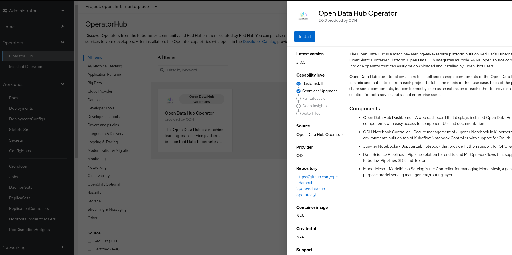
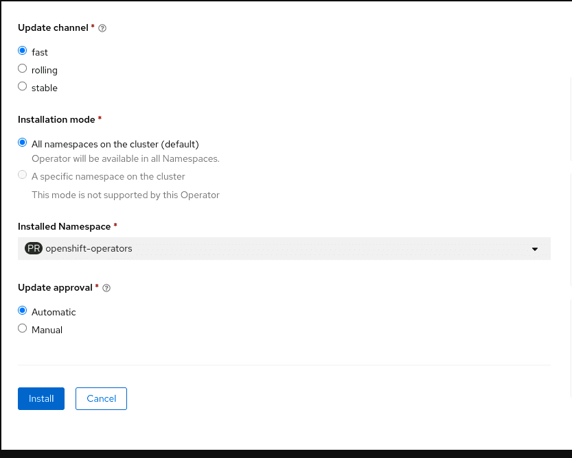
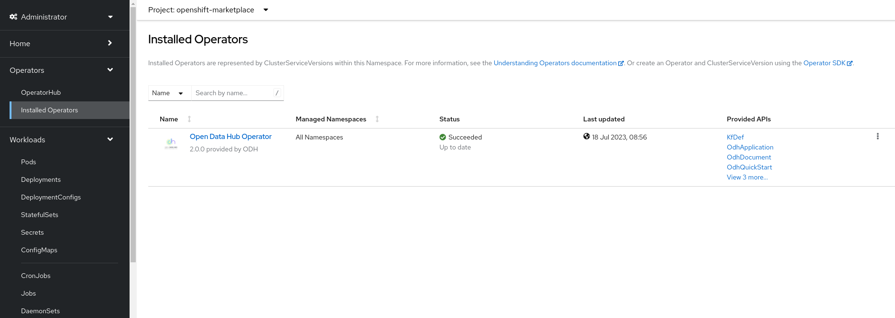
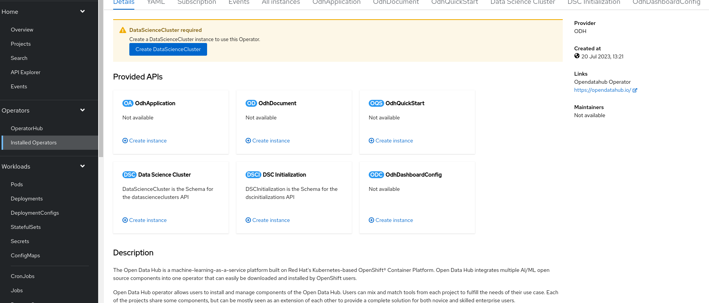
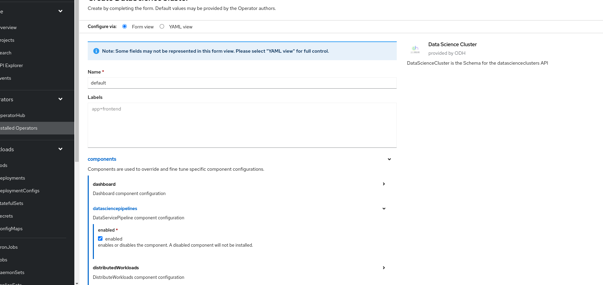
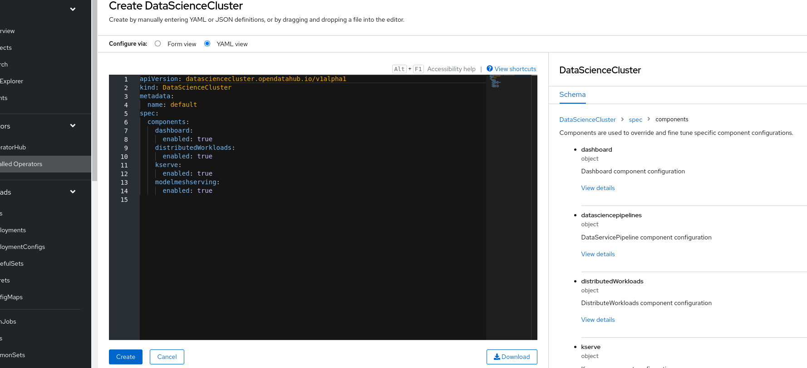
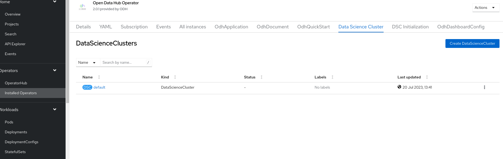
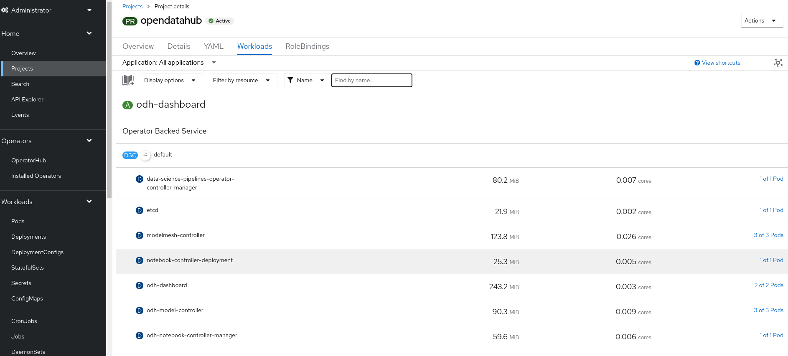

## disclaimer

Version 2.0.0 represents an alpha release, exclusively accessible via the "fast" channel.
Subsequent releases will transition to the "fast" channel once the new operator attains greater stability.

For installation steps of the old (version 1.X, stable),
see [quick installation of the 1.X version](../quick-installation).

### Pre-requisites

Below information is only appliable for Open Data Hub Operator v2.0.0 and forth release.

Installing Open Data Hub requires OpenShift Container Platform version 4.10+.
All screenshots and instructions are from OpenShift 4.12.
For the purposes of this quick start, we used [try.openshift.com](https://try.openshift.com/) on AWS.

Tutorials will require an OpenShift cluster with a minimum of 16 CPUS and 32GB of memory across all OpenShift worker nodes.

### Installing the New Open Data Hub Operator

The Open Data Hub operator is available for deployment in the OpenShift OperatorHub as a Community Operators. You can install it from the OpenShift web console by following the steps below:

1. From the OpenShift web console, log in as a user with `cluster-admin` privileges.  For a developer installation from [try.openshift.com](https://try.openshift.com/), the `kubeadmin` user will work.
   

2. On the lefthand bar, from `Operators` -> `OperatorHub`,
   - filter for `Open Data Hub Operator`.
   - select `AI/Machine Learning` and look for the icon for `Open Data Hub Operator`.
   

3. Click `Continue` in the "Show community Operator" dialog if it pops out. Click the `Install` button to install the Open Data Hub operator.
   

4. The subscription creation view will offer a few options including `Update Channel`, make sure the `fast` channel is selected. Click `Install` to deploy the opendatahub operator into the `openshift-operators` namespace.
   

5. To view the status of the Open Data Hub operator installation, find the Open Data Hub Operator under `Operators` -> `Installed Operators`. It might take a couple of minutes to show, but once the `Status` field displays `Succeeded`, you can proceed to create a DataScienceCluster instance
   

### Create a DataScienceCluster instance

1. Click on the `Open Data Hub Operator` from `Installed Operators` page to bring up the details for the version that is currently installed.
   

2. Two ways to create DataScienceCluster instance:
   - Click `Create DataScienceCluster` button from the top warning dialog `DataScienceCluster required(Create a DataScienceCluster instance to use this Operator.)`
   - Click tab `Data Science Cluster` then click `Create DataScienceCluster` button

   They both lead to a new view called "Create DataScienceCluster". By default, namespace/project `opendatahub` is used to host all applications.

3. In the view of "Create DataScienceCluster", user can create DataScienceCluster instance in two ways with `components` fields.
   - Configure via "Form view":
      1. fill in `Name` field
      2. in the `components` section, by clicking `>` it expands currently supported core components. Check the set of components enabled by default and tick/untick the box in each component section to tailor the selection.
      

   - Configure via "YAML view":
      1. write config in YAML format
      2. get detail schema by expanding righthand sidebar 
      3. read [ODH Core components](../tiered-components) to get the full list of supported components

4. Click `Create` button to finalize creation process in seconds.
   

5. Verify the installation by viewing the project workload.
   Click `Home` then `Projects`, select "opendatahub-system" project, in the `Workloads` tab to view enabled compoenents. These should be running.
   

### Dependencies

- to use "kserve" component, users are required to install two operators via OperatorHub before enable it in DataScienceCluster CR
   1. Red Hat OpenShift Serverless Operator from "Red Hat" catalog.
   2. Red Hat OpenShift Service Mesh Operator from "Red Hat" catalog.

- to use "datasciencepipeline" component, users are required to install one operator via OperatorHub before enable it in DataScienceCluster CR
   1. Red Hat OpenShift Pipelines Operator from "Red Hat" catalog.

- to use "distributedworkloads" component, users are required to install one operator via OperatorHub before enable it in DataScienceCluster CR
   1. CodeFlare Operator from "Community" catalog.

- to use "modelmesh" component, users are required to install one operator via OperatorHub before enable it in DataScienceCluster CR
   1. Prometheus Operator from "Community" catalog.
