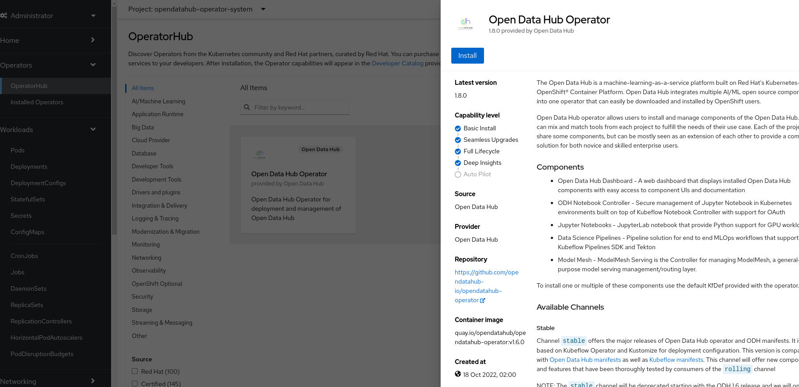
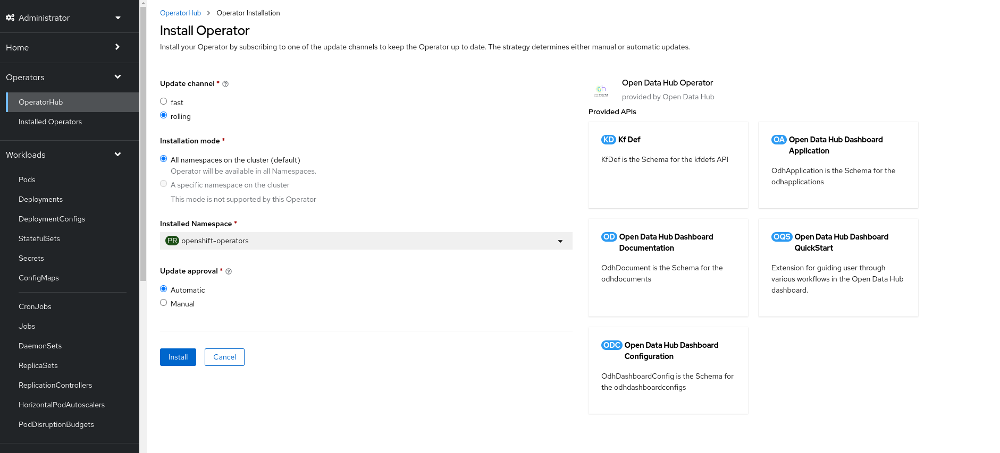
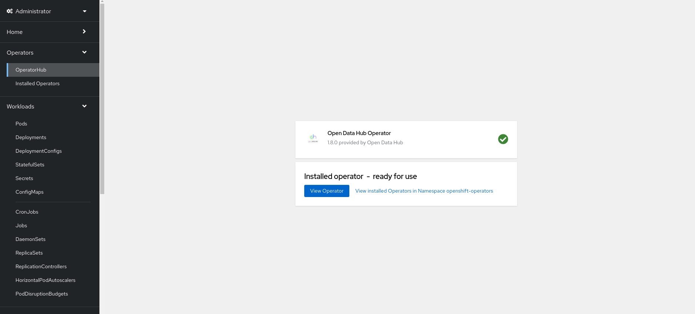
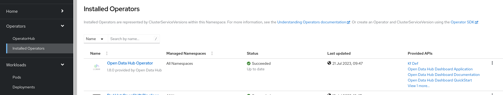
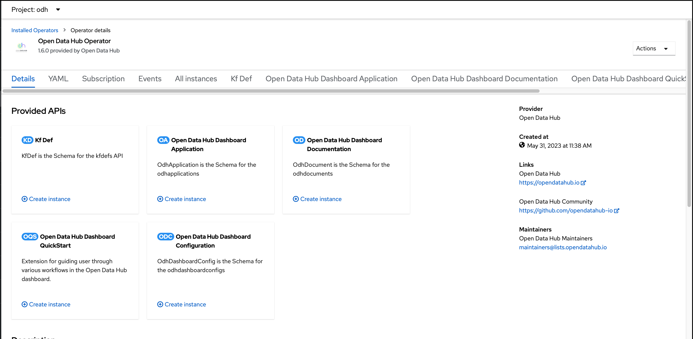
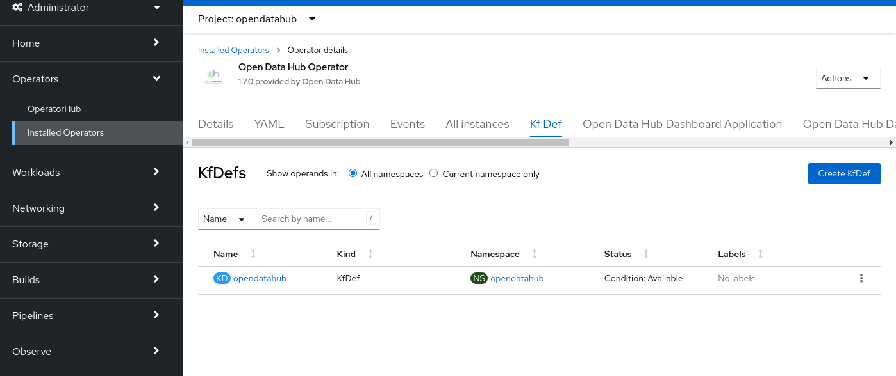
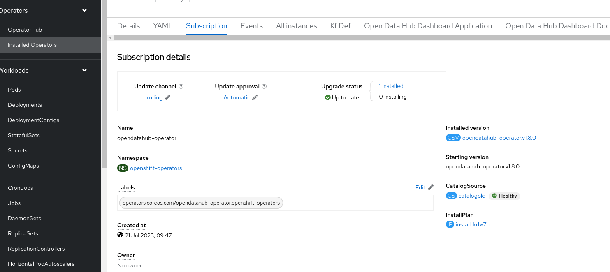

### Pre-requisites

Installing Open Data Hub requires OpenShift Container Platform version 4.10+. All screenshots and instructions are from OpenShift 4.10.  For the purposes of this quick start, we used [try.openshift.com](https://try.openshift.com/) on AWS.  Tutorials will require an OpenShift cluster with a minimum of 16 CPUS and 32GB of memory across all OpenShift worker nodes.

### Installing the Open Data Hub Operator

The Open Data Hub operator is available for deployment in the OpenShift OperatorHub as a Community Operator. You can install it from the OpenShift web console by following the steps below:

1. From the OpenShift web console, log in as a user with `cluster-admin` privileges.  For a developer installation from [try.openshift.com](https://try.openshift.com/), the `kubeadmin` user will work.
   

1. Create a new namespace named 'odh' for your installation of Open Data Hub.
   

1. Find `Open Data Hub` in the `OperatorHub` catalog.
   1. Select the new namespace if not already selected.
   1. Under `Operators`, select `OperatorHub` for a list of operators available for deployment.
   1. Filter for `Open Data Hub` or look under `AI/Machine Learning` for the icon for `Open Data Hub`.
   

1. Click the `Install` button and follow the installation instructions to install the Open Data Hub operator.
   

1. The subscription creation view will offer a few options including *Update Channel*, 

**For those who wants to upgrade to new operator(version 2.X)**, please switch to continue reading [here from step 4](../quick-installation-new-operator#installing-the-new-open-data-hub-operator)

**For those who wants to keep using old operator(version 1.X)**, please continue reading: 
keep the `rolling` channel selected. Click `Install` to deploy the opendatahub operator into the `openshift-operators` namespace.
   

1. Click `View Operator` to navigate to the OpenShift OperatorHub page for the newly install ODH operator.
   

1. To view the status of the Open Data Hub operator installation, find the Open Data Hub Operator under Operators -> Installed Operators. Be aware to select `odh` namespace in the console UI. Once the STATUS field displays InstallSucceeded, you can proceed to create a new Open Data Hub deployment.

   If you Create an Instance that is not under`odh` a fatal error similar to "csv created in namespace with multiple operatorgroups, can't pick one automatically" will be raised.
   

1. To view the status of the Open Data Hub operator installation, find the Open Data Hub Operator under `Operators` -> `Installed Operators` (inside the namespace you created earlier). Once the STATUS field displays `Succeeded`, you can proceed to create a new Open Data Hub deployment.
   

### Create a New Open Data Hub Deployment

The Open Data Hub operator will create new Open Data Hub deployments and manage its components.  Let's create a new Open Data Hub deployment.

1. Find the Open Data Hub Operator under `Installed Operators` (inside the namespace you created earlier)
   

1. Click on the Open Data Hub Operator to bring up the details for the version that is currently installed.
   

1. Click `Create Instance` for `KfDef` to create a new deployment.  The default `kfdef` provided will deploy the latest release of the [ODH Core components](../tiered-components). If you accepted the default name, this will trigger the creation of an Open Data Hub kfdef object named `opendatahub` and start the rollout of the [ODH Core components](../tiered-components).
   

1. Verify the installation by viewing the Open Data Hub tab within the operator details.  You Should see `opendatahub` listed.
   

1. Verify the installation by viewing the project workload.  The [ODH Core components](../tiered-components) should be running.
   

### Upgrade to new operator(version 2.X)

If you are currently having version 1.X installed and prefer upgrading to new operator 2.X, please follow below instruction:

- Login from the OpenShift web console with `cluster-admin` privileges
- Go to `Operator` -> `Installed Operators`, choose `Open Data Hub Operator` which is on 1.X version.
- Click `Subscription` tab
- In the `Update channel` section, you should see `rolling` as the current channel.

- Click `pencil` icon next to `rolling`, in the popup window `Change Subscription update channel`, tick `fast` icon, then `Save` your option.
- If you have `Update approval` already configed to `Automatic`, you should see `Upgrade status` change to `1 installing` in minutes.
- The rest steps, please refer to [here from step 5](../quick-installation-new-operator#installing-the-new-open-data-hub-operator)

#### disclaimer

1. Version 2.0.0 represents an alpha release, exclusively accessible via the "fast" channel.

Subsequent releases will transition to the "rolling" channel once the new operator attains greater stability.

2. During the installation of the new operator (v2.X), applications will not be automatically updated from v1.X to v2.X.

Users will need to create a DataScienceCluster instance and enable specific components based on their requirements.

3. If the current application namespace for v1.X is not "opendatahub", users must scale down the components first.
